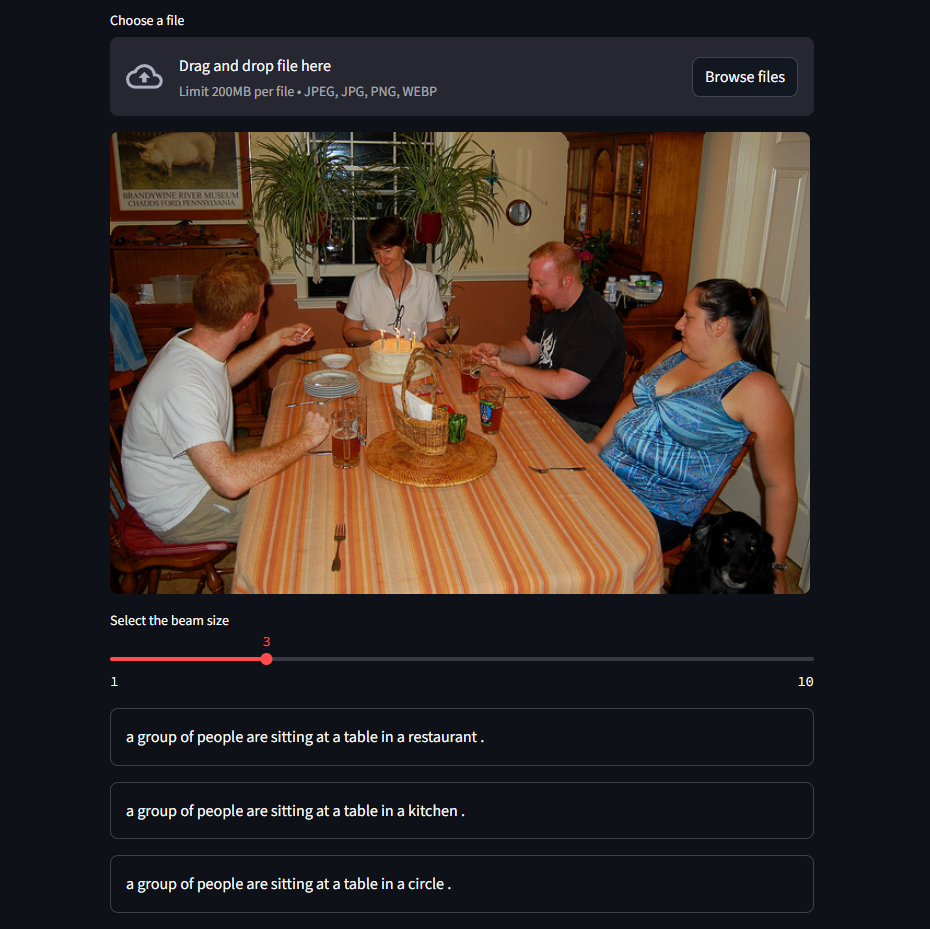
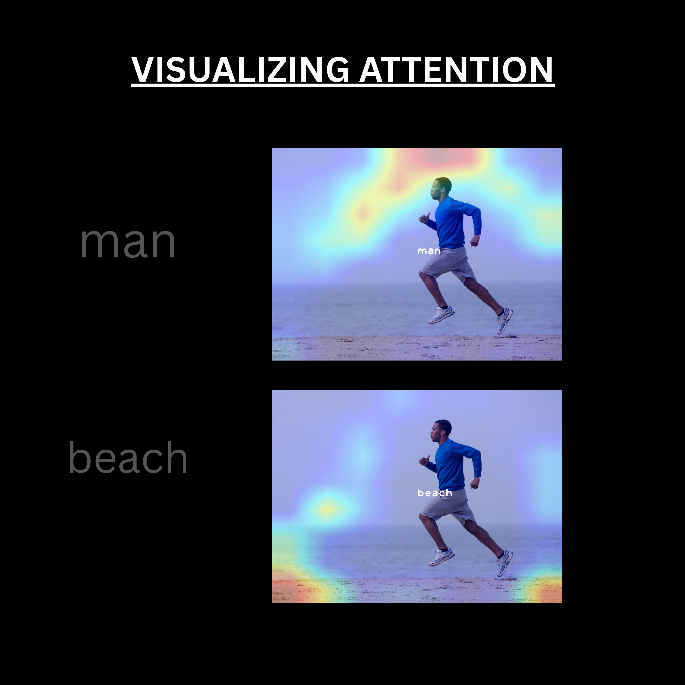
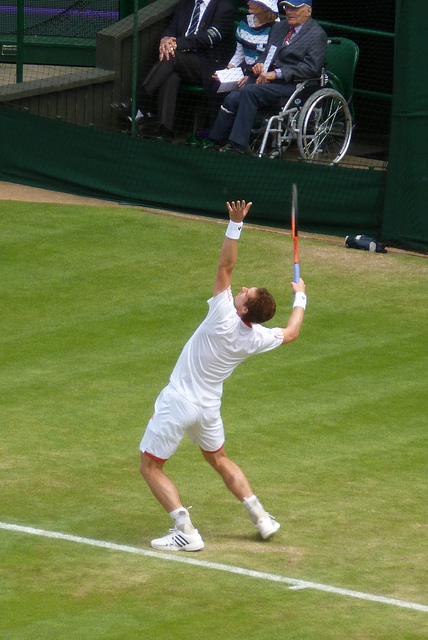

# Image Captioning with InceptionV3 + LSTM + Bahdanau Attention

## Demo



This project implements an image captioning system using an **InceptionV3** image encoder and an **LSTM** decoder with **Bahdanau attention**. The model generates natural language descriptions for input images, and includes a Streamlit web app for interactive caption generation.

## Features

- **Encoder**: Pretrained InceptionV3 extracts image features.
- **Attention**: Bahdanau attention mechanism focuses on relevant image regions during caption generation.
- **Decoder**: LSTM generates captions word-by-word.
- **Web App**: Upload your own images or use sample images to generate captions interactively.
- **Visualization**: Includes attention visualizations for interpretability.

---




---

## Getting Started

### Prerequisites

Install the required Python packages:

```bash
pip install -r requirements.txt
```

You may also need to download NLTK data:

```python
import nltk
nltk.download('punkt')
```

### Files & Folders

- `app.py` — Streamlit web app for image captioning.
- `functions.py` — Model architecture, training, and caption generation logic.
- `new_best_modelweights1.pth.tar` — Pretrained model weights (ignored by git).
- `vocab.pkl` — Vocabulary pickle file.
- `sample_images/` — Example images for quick testing.
- `BanhadauAttentionVisualization/` — Additional attention visualizations.
- `ss.png` — Screenshot of the web app.
- `VisualizingBanhadauAttention.png` — Example of attention visualization.

---

## Usage

### 1. Launch the Web App

```bash
streamlit run app.py
```

### 2. Interact

- **Upload** an image (JPEG, PNG, WEBP) or select a sample image from the sidebar.
- Adjust the **beam size** slider for caption diversity.
- View generated captions and attention visualizations.

---

## Model Details

- **Encoder**: InceptionV3 (pretrained on ImageNet, for feature map extraction)
- **Attention**: Bahdanau (additive) attention over spatial image features
- **Decoder**: LSTM with word embeddings
- **Training Data**: Flickr30k (see notebooks for details)
- **Beam Search**: Used for generating diverse and high-quality captions
- **Performance**: Achieved BLEU-1 score of **0.64** on the test set

---

## Visualizations

- **ss.png**: Screenshot of the Streamlit app interface.
- **VisualizingBanhadauAttention.png**: Example of attention weights overlayed on an image.
- **BanhadauAttentionVisualization/**: Folder with more attention visualizations for various images and timesteps.

---

## Example

1. Select or upload an image:
   
2. The app generates captions like:
   ```
   a group of people standing around a kitchen preparing food .
   a man and woman are preparing food in a kitchen .
   ```
3. Attention visualization shows which parts of the image the model focused on for each word.

---

## Notes

- The model weights (`new_best_modelweights1.pth.tar`) and vocabulary (`vocab.pkl`) are large and are not tracked by git.
- For training or dataset preparation, see `Inception_LSTM.ipynb` and `test.ipynb`.
- The app will use GPU if available, otherwise CPU.

---

## Acknowledgements

- [PyTorch](https://pytorch.org/)
- [Streamlit](https://streamlit.io/)
- [Flickr30k Dataset](https://www.kaggle.com/datasets/hsankesara/flickr-image-dataset)
- [Bahdanau et al., 2014](https://arxiv.org/abs/1409.0473) (Attention mechanism)

--- 